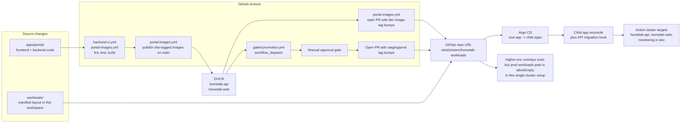

# Deployment Flow

This view focuses on how source changes become running workloads: validation, image publication, GitOps manifest updates, Argo CD sync, and the higher-environment promotion gate.

## What It Shows

The active delivery path is centered on `apps/portal/.github/workflows/portal-images.yml`. On `main`, that workflow publishes SHA-pinned `homelab-api` and `homelab-web` images to GHCR, then opens a PR against the GitOps repo to update the dev overlay image tags. Argo CD watches the GitOps repo and reconciles the child applications into the cluster.

The repo also contains a higher-environment promotion workflow in `apps/portal/.github/workflows/gated-promotion.yml`. That path is real and repo-backed, but this cluster is still in single-cluster safety mode: `workloads/environments/prod/workloads/kustomization.yaml` is intentionally empty, so prod overlays exist without an active prod workloads deployment target here.

The API migration job is part of the deployment flow because `workloads/apps/homelab-api/base/migration-job.yaml` is an Argo CD sync hook, not a separate out-of-band step.

## Trust Boundaries

- GitHub Actions and GHCR are outside the cluster trust boundary. They produce artifacts and manifest PRs, but do not deploy directly with `kubectl`.
- The merge into the GitOps repo is the handoff point between CI and cluster state. Argo CD, not the image pipeline, performs the final reconcile.
- Manual approval is required before the gated promotion workflow prepares higher-environment PRs, which creates a distinct operator control point for non-dev rollouts.

## Update It When

- CI or image publication logic changes in `apps/portal/.github/workflows/portal-images.yml` or `apps/portal/.github/workflows/backend-ci.yml`
- Higher-environment gating changes in `apps/portal/.github/workflows/gated-promotion.yml`
- Argo app roots or environment paths change in `workloads/bootstrap/` or `workloads/environments/`
- Overlay patch file locations or image tag conventions change in `workloads/apps/homelab-api/envs/` or `workloads/apps/homelab-web/envs/`

## Related Decisions

- [ADR 0002: Argo CD as the GitOps controller](../adr/0002-argocd-gitops-model.md)
- [ADR 0004: Kustomize base and overlay layering](../adr/0004-manifest-layering-kustomize-over-helm-values.md)
- [ADR 0005: Day-0 vs Day-2 ownership split](../adr/0005-day-0-vs-day-2-ownership-model.md)
- [ADR 0007: Portal-to-Git workflow model](../adr/0007-portal-to-git-workflow-model.md)
