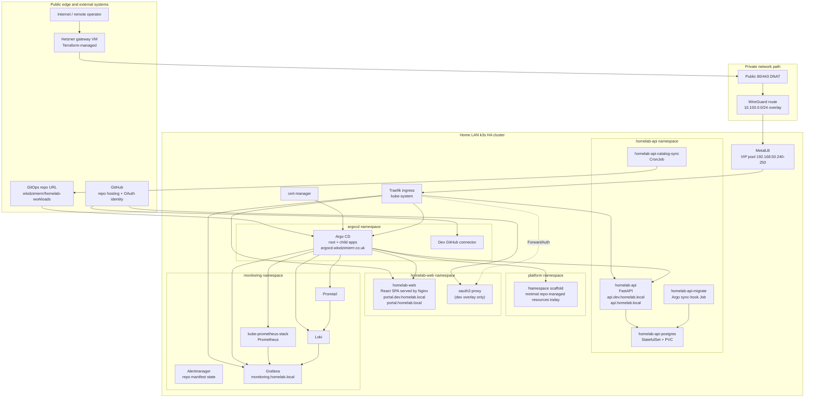

# Platform Overview

This view summarizes the repo-defined runtime platform: the day-0 gateway and cluster edge, Argo CD GitOps wiring, workload namespaces, and the main portal and observability components.

## What It Shows

The repo currently models a split between day-0 infrastructure and day-2 GitOps workloads. Terraform and Ansible establish the Hetzner gateway, WireGuard path, k3s HA cluster, MetalLB, Traefik, cert-manager, and Argo CD. Argo CD then reconciles the workload namespaces for `homelab-web`, `homelab-api`, and `monitoring`.

The `platform` namespace appears to be mostly a scaffold in this repo today, rather than a large bundle of shared services. That is inferred from `workloads/platform/base/kustomization.yaml` and the current platform app contents.

Alertmanager is shown because the current dev `kube-prometheus-stack` values in `workloads/environments/dev/workloads/monitoring-app.yaml` set `alertmanager.enabled: true`. Some runbooks and issue notes still describe the older disabled state, so treat this as "repo manifest state; cluster validation may still be pending".

## Trust Boundaries

- The public edge ends at the Hetzner gateway. Public `80/443` traffic is forwarded across a WireGuard path into the home LAN before it reaches Traefik.
- GitHub is outside the cluster trust boundary for both repo hosting and OAuth identity. Argo CD GitOps access and the dev portal OAuth flow both depend on it.
- Namespace boundaries matter inside the cluster. `homelab-web` and `homelab-api` both use default-deny NetworkPolicies with explicit allow lists, while monitoring runs in its own namespace and is queried in-cluster by the backend.

## Update It When

- Gateway, WireGuard, MetalLB, or Traefik routing changes in `terraform/gateway/`, `ansible/inventory/`, or [`../day-0-rebuild-runbook.md`](../day-0-rebuild-runbook.md)
- Argo CD bootstrap or project structure changes in `workloads/bootstrap/` or `workloads/environments/`
- Namespace contents change under `workloads/apps/homelab-api/`, `workloads/apps/homelab-web/`, or `workloads/environments/dev/workloads/`
- Auth decisions move between basic auth, oauth2-proxy, Dex, or another provider; see [ADR 0006](../adr/0006-oauth-vs-cloudflare-zero-trust.md)
