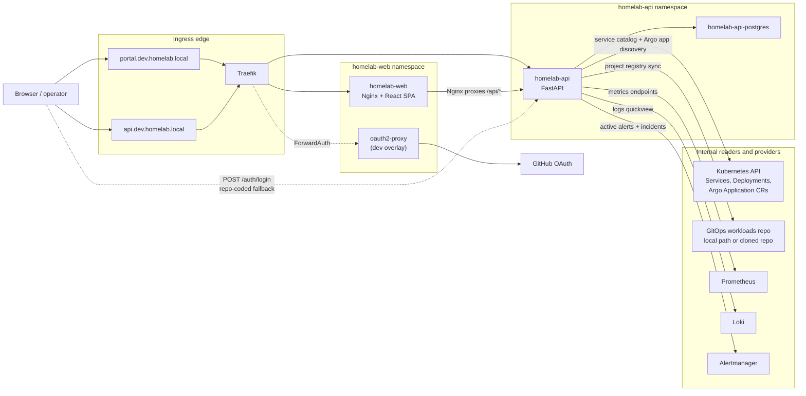

# Service / API Map

This view follows the portal request paths and the backend's live integrations. It intentionally shows both auth mechanisms that currently coexist in repo state: ingress SSO in the dev overlay and the older app-level bearer-token login still present in the SPA and backend.

## What It Shows

The normal browser path for the dev portal is `portal.dev.homelab.local` through Traefik into `homelab-web`, with `/api/*` proxied by Nginx to the in-cluster `homelab-api` service. There is also a direct API ingress host at `api.dev.homelab.local` for calling the backend without going through the frontend container.

The backend's implemented live integrations come from code, not just manifests: it reads Kubernetes Services, Deployments, and Argo `Application` CRs through the Kubernetes API; reads GitOps project metadata from the workloads repo path or a cloned repo; and queries Prometheus, Loki, and Alertmanager over their in-cluster service URLs.

Auth is currently layered rather than unified. In the dev overlay, Traefik uses `oauth2-proxy` ForwardAuth with GitHub OAuth. Separately, the SPA still routes users through `/auth/login`, and the backend still issues the hard-coded `dev-static-token` on successful `admin/changeme` login. The API accepts either forwarded auth headers (`X-Auth-Request-*`) or the bearer token path, so both are part of the current repo-defined design.

Frontend links out to Argo CD and Grafana only when `VITE_ARGO_BASE_URL` and `VITE_GRAFANA_BASE_URL` are configured; those are optional deep links rather than core data-plane dependencies.

## Trust Boundaries

- Browser traffic crosses the ingress boundary at Traefik. In dev, authentication is first enforced at the ingress middleware layer before the request reaches the SPA.
- The `homelab-web` to `homelab-api` hop is an internal namespace-to-namespace call controlled by explicit NetworkPolicy allows.
- The backend then crosses into separate internal trust zones: Postgres for persistence, Kubernetes and GitOps sources for topology data, and monitoring providers for runtime signals.

## Update It When

- Frontend API proxying or route guards change in `apps/portal/frontend/nginx.conf`, `apps/portal/frontend/src/App.tsx`, or `apps/portal/frontend/src/lib/api.ts`
- Backend auth handling or provider clients change in `apps/portal/backend/app/main.py`, `apps/portal/backend/app/service_registry_sync.py`, `apps/portal/backend/app/gitops_project_sync.py`, or `apps/portal/backend/app/monitoring_providers.py`
- Dev ingress auth changes in `workloads/apps/homelab-web/envs/dev/`
- Service names, namespace boundaries, or database topology change in `workloads/apps/homelab-api/` or `workloads/apps/homelab-web/`

## Related References

- [OIDC / SSO setup runbook](../runbooks/oidc-setup.md)
- [SSO break-glass runbook](../runbooks/sso-break-glass.md)
- [Service identity contract](../contracts/service-identity.md)
